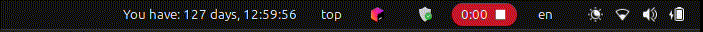

# Countdown Timer:

### Description:

The Countdown Timer enhances your desktop experience by providing a simple yet powerful countdown timer directly in the GNOME top bar. This extension helps you track multiple goals by displaying the time remaining for each one, ensuring you stay on schedule and organized.

### Features:

1. **Multiple Goal Tracking:** Set and manage multiple countdowns for various tasks or deadlines, such as assignments, events, or personal goals.
2. **Customizable Titles:** Easily customize the title for each goal, providing a clear context for each countdown.
3. **User-Friendly Interface:** Seamlessly integrates into the GNOME top bar, providing a native look and feel.

### Installation

1. You must have [Argos GNOME Shell Extension](https://github.com/p-e-w/argos) installed.

2. Run:

```bash
$ cd ~/.config/argos
$ wget https://raw.githubusercontent.com/shindeshubhamm/argos-scripts/refs/heads/main/countdown/countdown.1s.py
$ chmod +x countdown.1s.py
```

3. Add your goals to the `goals` list in the `countdown.1s.py` file. The first goal will be shown in the topbar. The rest will be visible on click.

This is how the countdown timer looks in your topbar!

